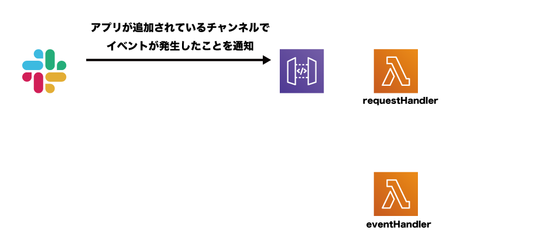
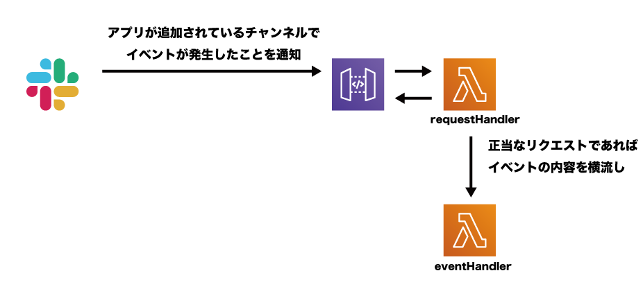
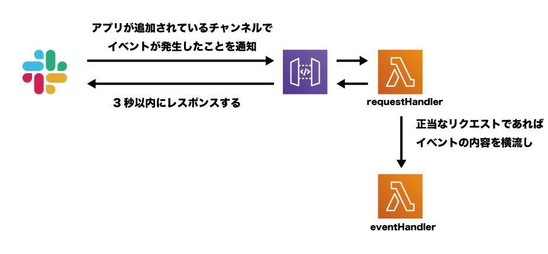

# Slackアプリ All Timesについて

@snap[south text-center text-08]
Ryosuke Nakagawa
@snapend

---
@snap[north span-40]
### きっかけ
@snapend

@snap[center]
@fa[slack]に#timesが多すぎる!
もし全部にjoinすると・・・
@snapend

---
@title[Slackスクリーンショット]

@img[span-80 position_center](assets/img/slack_home_normal.png)

+++
@title[Slackスクリーンショット]

@img[span-80 position_center](assets/img/slack_home_fruid.png)

+++
@title[Slackスクリーンショット]

@img[span-80 position_center](assets/img/slack_home_fruid_rect.png)


---
@title[exploding head]

@snap[center text-center text-40]
🤯
@snapend

<!-- 6枚目 -->
---?color=white
@title[ディストラクタ]

@snap[center text-06 span-100 cite]
> "「集中力を削ぐものを、心理学では『ディストラクター』といいます。
> 視界の隅で動くものなど、目に入ってくるものが最も人間の注意力を奪うのですが、
> 工事現場の騒音など、耳から入ってくるものも
> ディストラクターの一種だと考えることができます」"
@snapend

@snap[south-east text-03]
cited from [集中力の高め方を心理学者が伝授「ディストラクター」をなくすこと](https://news.livedoor.com/article/detail/10669129/)
@snapend

---
@title[どんな機能がほしいか]

@snap[north]
### 要望
@snapend

@snap[west span-100]
@ul[list-spaced-bullets text-08]
- チャンネルをブックマークして後でまとめてチェックしたい
- メッセージの投稿者かわかる
- botのメッセージは拾う必要はない
- その日にイベント起こったチャンネルだけチェックしたい
@ulend
@snapend

<!-- 7枚目 -->
---

@snap[center text-center text-40]
🤔
@snapend

<!-- 8枚目 -->
---?color=white
@title[All Timesの紹介]

@snap[center span-100 position_center]

@snapend

<!-- 9枚目 -->
---

@snap[center text-center text-30]
DEMO
@snapend

<!-- 9枚目 -->
---
@title[アーキテクチャ]

@snap[center text-center span-100 position_center]

@snapend

<!-- 10枚目 -->
+++

@snap[center text-center span-100]

@snapend

<!-- 11枚目 -->
+++

@snap[center text-center span-100]

@snapend

<!-- 7-3 -->
+++

@snap[center text-center span-100]

@snapend

<!-- 7-4 -->
+++

@snap[center text-center span-100]

@snapend

<!-- 7-5 -->
+++

@snap[center text-center span-100]

@snapend

<!-- 7-6 -->
+++

@snap[center text-center span-100]

@snapend

---
@title[event]

@snap[north span-100 text-09]
イベントが発生したときに
送られてくるJSON（一部抜粋）
@snapend

@snap[center]
```json
{
  'token': '********',
  'api_app_id': '********',
  'event': {
    'type': 'message',
    'text': '増税対応お疲れさまでした',
    'user': 'UKDKXN543',
    'channel': 'CP2BU7SCC',
    'ts': '1570282631.000200',
    'team': 'TKT6H65TQ',
  },
  'type': 'event_callback',
  'authed_users': ['UNND549UZ']
}
```
@snapend

@snap[south span-100 text-gray text-08]
@[2-3](tokenとapi_app_idで正当なリクエストか検証)))
@[4-11](発生したイベントに関する情報)
@[5](発生したイベントのタイプ。これはメッセージが投稿されたとき。)
@[6](投稿されたメッセージ内容)
@[7](メッセージを投稿した人の **ID** )
@[8](メッセージを投稿されたチャンネルの **ID** )
@snapend

---
@title[EventHandlerの処理]

@snap[north span-100]
### eventHandlerのお仕事
@snapend


@snap[west span-100]
@ul[list-spaced-bullets text-08]
- チャンネルIDからチャンネル名（ex. times_bengal_cat）を取得
- ユーザーのIDからユーザー名とアイコンのURLを取得
- #all_timesに当日の投稿がすでにあるか調べる
- ある→スレッド形式で投稿
- ない→チャンネル名を投稿し、スレッド形式でメッセージを投稿
@ulend
@snapend

---

@title[feature work]

@snap[north span-100]
### まだ実装されていない機能
@snapend

@snap[west span-100]
@ul[list-spaced-bullets text-09]
- ファイルアップロードイベントへの対応
- メッセージ内のURLを展開
@ulend
@snapend


<!-- 最後のスライド -->
---

@snap[center text-18]
Have a good slack life @fa[slack]
@snapend
